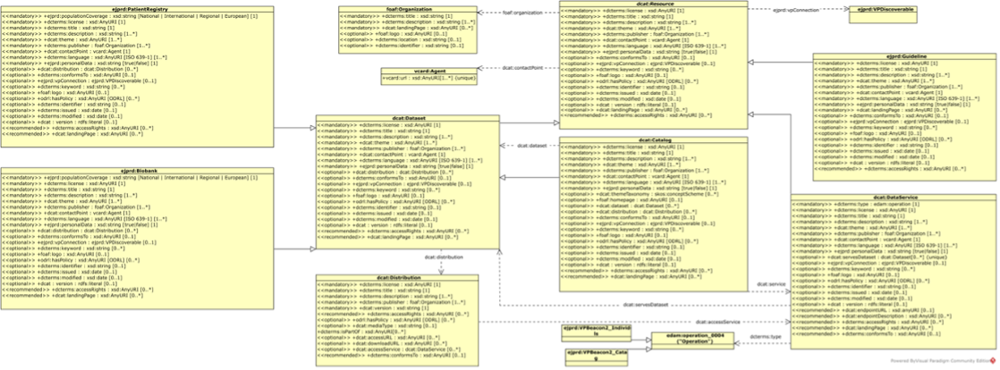

EJP RD Metadata Schema 
------------

Figure 5 describes the EJP RD VP metadata schema using the UML language. We describe the model and 
its components in the next subsection. Readers can get more information here on the `UML syntax <https://www.omg.org/spec/UML/>`_.

Reading the EJP RD Metadata Schema with UML
~~~~~~~~~~~~

The model is composed of classes, depicted as rectangles, which are interconnected by two types of lines. The lines with a closed arrow shape at the end represent the inheritance relationship, indicating that Class B extends Class A (arrow from B to A). This implies that B is a specialized version of A, with additional properties. On the other hand, lines with an open arrow shape at the end represent an access relationship, signifying that class A contains a property that points to class B (arrow from A to B). Representations of classes with real-world information are called instances. 

To illustrate, let us consider the “ERN Bond Catalogue” which can be defined as an instance of Catalogue, also a type of Resource (there is an arrow from Catalogue to Dataset and another one from Dataset to Resource). Therefore, the ERN Bond Catalogue entry should also contain all information required for the classes Dataset and Resource. Likewise, the “ERN Bond Catalogue” instance is expected to contain a pointer to another instance of Dataset (e.g., the “EuRR-Bone dataset”).

Figure 5 also depicts what information is mandatory for resources connecting to the VP, what is recommended to have and what is optional. It is important to note that certain classes are not applicable to certain cases. For instance, the class Resource is displayed in italic because it represents an abstract class. Abstract classes cannot be instantiated directly but serve as a basis for derived subclasses (such as Patient Registry, Datasets, Biobanks, etc..). Therefore, it is not expected to describe a Data Service as a Patient Registry. Although they can be described by the same schema, they should be represented by different instances. 

    Figure 5 Metadata schema for connection to the Rare Diseases Virtual Platform diagram. Source: `link <https://github.com/ejp-rd-vp/resource-metadata-schema/blob/master/images/diagram_onboarding_doc/ejprdmetadataschema.png>`_ 