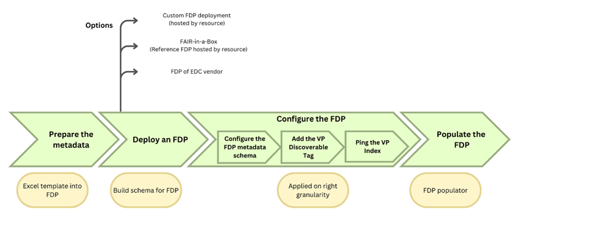

How to onboard to Level 1 using the EJP RD metadata schema	
------------

Resources should provide metadata through a standard mechanism. This can be done by exposing the metadata using the FAIR Data Point (`FDP <https://fairdatapoint.readthedocs.io/en/latest/>`_). The FDP specification describes the standard way by which the VP expects resources to provide access to their metadata.
 
The expected process to collect and make metadata available, alongside available options to do so, is described in Figure 6. The process consists of preparing metadata, deploying an FDP that will be populated with the metadata, adding a VPDiscoverable tag on the FDP, and configuring the FDP to ping the VP:

#. ** Preparing the metadata: ** This step involves preparing all the information that will be published on the VP. Preparing the metadata involves collecting all necessary information in formats that are compliant with the EJP RD metadata schema described in this document. This step can be done with the following options:
	* **Use your own tools:** Users familiar with DCAT and Resource Description Framework (RDF) can use their platform of choice to instantiate the metadata schema described below, host it in an appropriate server and connect it to the VP through API interactions.
	* **Use tools developed by EJP RD and partners:** Different tools were developed to facilitate connecting to the VP. Each tool is intended for different use cases considering, e.g., the users’ expertise (e.g., with semantic tools) and users’ goals. These tools are:
		* **FAIR Data Point Populator (FDP Populator):** The FDP populator is intended for users with any level of expertise that want to populate a pre-existing FDP. This tool automatically populates an FDP previously deployed with the information provided in an Excel template. The template [`link <https://github.com/ejp-rd-vp/resource-metadata-schema/blob/master/template/README.md>`_] contains tooltips and validators that support correctly inputting information. More information on the FDP populator can be found at [`link <https://github.com/ejp-rd-vp/fdp-populator>`_]. 
		* **FAIR in a Box (FiaB):** This tool deploys a FDP semi-automatically (few manual interactions are needed). It is intended for users with a certain level of technical expertise, although non-experts have been able to use it by following the tutorial available at [`link <https://github.com/ejp-rd-vp/FiaB>`_] and [`link <https://github.com/ejp-rd-vp/FDP-Configuration>`_].
		* **FAIR Data Point Reference Implementation (Reference FDP):** It provides a metadata editor function for advanced users. The function is available when a user logs into a deployed instance of the FDP reference implementation. The editor provides multiple ways to enter information about the resource, including directly populating the RDF file. The documentation about the Reference FDP can be found at [`link <https://fairdatapoint.readthedocs.io/en/latest/>`_], and instructions on how to connect it to the EJP RD VP are available at [`link <https://github.com/ejp-rd-vp/FDP-Configuration>`_]. 
	* **Use third-party tools:** Certain software tools, notably MOLGENIS [`link <https://www.molgenis.org/>`_], CastorEDC [`link <https://www.castoredc.com/>`_], and RD-Nexus [`link <https://www.cafevariome.org/>`_] have built-in FDP functionality. We recommend keeping a record of DCAT-based metadata 'at source'. 
#. **Deploying an FDP:** This step consists of having an FDP instance live and running. This instance will be populated with the information prepared in the previous step. Then, the FDP will be configured to connect to the VP in the following steps. Having an FDP instance ready to be populated can be done in different manners, as described in options listed in the first step. This includes manually deploying an FDP or doing it through the FDP-in-a-Box (FiaB) or by using an FDP of an EDC vendor. 
#. **Configuring the FDP:** This step includes three more specific steps.
	* **Configuring the FDP metadata schema to comply with the EJP RD metadata schema:** In this step, the FDP needs to be configured to extend its standard DCAT-based schema to incorporate EJP RD specific terms. This extension process is done according to the type of your resource, and it is further detailed at [`link <https://github.com/ejp-rd-vp/FDP-Reference-Implementation-Configuration>`_].
	* **Adding the VPDiscoverable tag:** This step consists of adding the adequate tag on the FDP configuration. This is necessary for the VP to understand which level your resource is compliant with. Adding the VPDiscoverable tag tells the VP that your resource is compliant with Level 1. More information on how to do so is described at [`link <https://github.com/ejp-rd-vp/FDP-Configuration#create-a-new-record---a-data-service-that-does-visualization-box-whisker-plot>`_].
	* **Pinging the VP Index:** This process consists of configuring the FDP instance, to “knock on the VP’s door and say ‘hi, I am alive! Please index me’”. This consists of setting the FDP to ping the VP from time to time (usually every five days) to inform the VP that the FDP instance is online and able to receive requests. This process is detailed at [`link <https://github.com/ejp-rd-vp/FDP-Reference-Implementation-Configuration>`_].
#. **Populating the FDP:** This step consists of including the metadata information prepared on the first step into the FDP. This can be done using the FDP Populator [`link <https://github.com/ejp-rd-vp/resource-metadata-schema/blob/master/template/README.md>`_], or by using the FDP interface (accessed by logging into the FDP with an editor or administrator account; recommended for advanced users only).

    Figure 6 - The process to collect and make metadata available on the VP.
