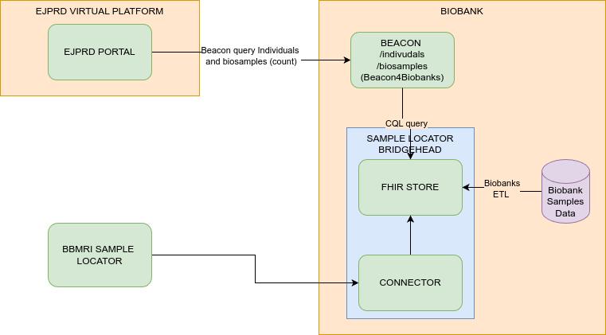

Beacon4Biobanks for Level 2 onboarding
------------

`Beacon4Biobanks <https://github.com/crs4/Beacon4Biobanks/tree/bbmri_backends>` is a service that implements the EJP-RD VP API specs to query 
for /individuals and /biosamples endpoints for a biobank.
It can be adopted by biobanks that are part of the `Sample Locator <https://samplelocator.bbmri.de/>`, one of the solutions provided 
to participate in the `BBMRI Federated Platform <https://www.bbmri-eric.eu/federated-platform/>`. 

The Sample Locator provides the biobanks with a tool called Bridghead, which stores data about biosamples and donors in an HL7 FHIR Store. 
The Beacon4Biobanks service is an additional service that performs the Beacon queries, as required by the specification, 
against the FHIR Store of the Bridgehead, and returns the count of individuals or biosamples. 
Since the API relies on the Sample Locator's Bridgehead, a biobank that has already joined it can be onboarded in the EJP-RD VP by adding the
Beacon4Biobank service to its stack. If a biobank is not in the BBMRI Sample Locator, it can first 
