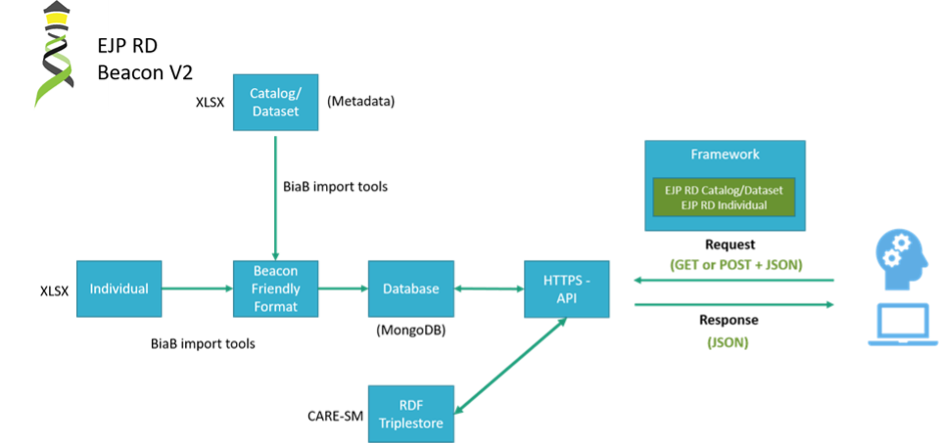

Beacon-in-a-Box (BiaB) for Level 2 onboarding
------------

This solution for a Level 2 connection is based on GA4GH Beacon v4 Reference Implementation (B2RI) reference software [`link <https://github.com/ejp-rd-vp/vp-api-specs/tree/v4.0_spec>`_], a **non-dockerised** version of BiaB is developed for our customised ERDERA Beacon v2 API Specification. More details are show in Figure 8.

    Figure 8 – Beacon-in-a-Box overview. Abbreviations: Microsoft Excel Spreadsheet (XLSX), Beacon-in-a-Box (BiaB), Common Data Elements for Rare Diseases Registration (CDE)
