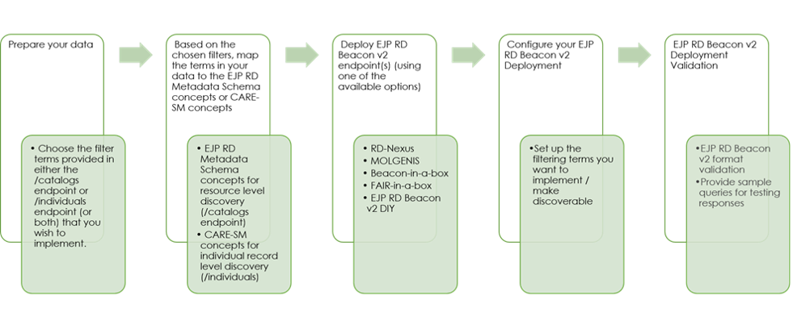

How to onboard to Level 2 using the VP-API Specification
------------

Transitioning to Level 2 involves seamlessly integrating resources with the EJP RD VP API Specification, a gateway to further unlock the capabilities of the Virtual Platform. This integration is facilitated by a suite of optional tools that pave the way for a comprehensive resource discovery experience. We offer five solutions for onboarding, which are described in the following sections. Figure 7 depicts the steps of the Level 2 onboarding process.

    Figure 7 – Level 2 onboarding process overview

Level 2 onboarding solutions
------------

.. list-table:: Overview of the Level 2 onboarding solutions
   :widths: 10 20 25 10 10 10 10 
   :header-rows: 1

   * - Solution
     - Description
     - Capabilities
     - Licensing
     - Support Offered
     - Supports Level 1?
     - Supports Level 2?
   * - `RD-Nexus <https://vp-onboarding-doc.readthedocs.io/en/latest/level_2/solutions/rd_nexus.html>`_
     - RD-Nexus is a convenient data discovery tool that adapts to many use cases and diverse datatypes. It utilises graph-based technologies to leverage semantic similarity and ontology mapping standards and is compatible with any input data format. Compliant with all major RD standards.   
     - API support for Any/All EJP RD Beacon v2 queries; Storage and Query of Metadata; Storage and Query of safe (or rich) demographic, sample, phenotypic and other data (omics, tabular, images); Ingest/Use any data format; Real-time query execution; Powerful similarity searching (phenotypes and disease); Enforce ontologies or controlled vocabularies; Dockerised & Non-Dockerised Install options; Inbuilt modular query & admin interfaces; Supports federated AuthN/AuthZ (inc LS AAI); Secure operation across firewall (via polling); Create/Manage secure custom networks.  
     - RD-Nexus is free to use under the MIT License.
     - Yes: Installation and hosting support. Demo and customisation support. Guidance on setting up private networks.   
     - Yes
     - Yes
   * - `MOLGENIS <https://vp-onboarding-doc.readthedocs.io/en/latest/level_2/solutions/molgenis.html>`_
     - MOLGENIS (MOLecular GENetics Information Systems), is an open-source platform designed for managing and analyzing complex biomedical and genetic data. It supports the creation of RD registries, including discovery functions. 
     - Supports EJP RD Beacon v2 queries; Structured Data Management; FAIR data sharing; secure access; Scripting & visualisation; Harmonization and integration; Task automation; High-performance computing.
     - MOLGENIS is free to use under LGPLv3 License.
     - Yes. Helpdesk available for any developer or user questions. Additional services offered for hosted installations and backups at a low fee.  
     - Yes
     - Yes
   * - `Beacon-in-a-Box <https://vp-onboarding-doc.readthedocs.io/en/latest/level_2/solutions/biab.html>`_
     - Specialised version of the GA4GH Beacon adapted to enable easy setup of EJP-RD Level-2 services.
     - Beacon deployment for /catalogs & /individuals endpoint; Docker & Docker-less deployment.
     - Beacon is free to use under the Apache License 2.0.
     - Yes
     - No
     - No
   * - `FAIR-in-a-Box <https://vp-onboarding-doc.readthedocs.io/en/latest/level_2/solutions/fiab.html>`_
     - FAIR-in-a-Box  software enables the setup of a local Fair Data Point that holds your data in an accessible triple-store, with EJP RD Beacon v2 services. 
     - Supports EJP RD Beacon v2 queries for both the /catalogs & /individuals endpoints; Dockerized installation. 
     - FAIR-in-a-box is free to use; individual components have distinct licenses selected by their (third-party) authors.
     - Yes
     - Yes
     - Yes
   * - `EJP RD Beacon v2 DIY <https://vp-onboarding-doc.readthedocs.io/en/latest/level_2/solutions/dyi.html#>`_
     - A custom solution can be created by any developer comfortable with Python/Flask or similar backend technologies (support and guidance on this is available).
     - ‎  
     - Licensing will depend on the technologies chosen for your custom solution. 
     -  
     - No 
     - 
   * - `Beacon4Biobanks <https://vp-onboarding-doc.readthedocs.io/en/latest/level_2/solutions/b4b.html#>`_
     - A solution specific for biobanks that are part or plan to be part of the `BBMRI Sample Locator <https://samplelocator.bbmri.de/>`_.
     - Beacon4Biobanks implements the /individuals and /biosamples endpoints of the VP API Specs by querying the FHIR Store of the Sample Locator 
     - It is based on the Beacon Reference Implementation so it has the same license (Apache License 2)
     -  
     - No 
     - Yes

.. toctree::
   :maxdepth: 1
   :caption: Solutions:

   solutions/rd_nexus
   solutions/molgenis
   solutions/biab
   solutions/fiab
   solutions/dyi
   solutions/b4b

   