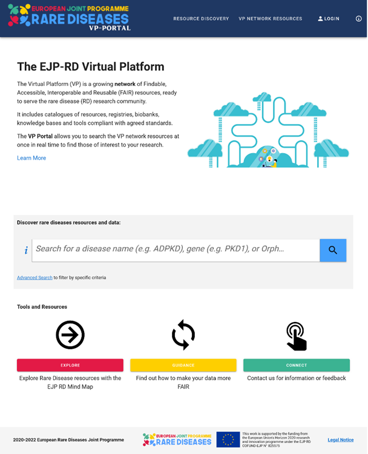

The EJP RD VP reference implementation: VP Portal
===================================

The Virtual Platform Portal (VP Portal) is a component developed within the EJP RD to allow researchers, patients or any person who is interested in the field of rare disease to search for resources within the VP network at once in real time. It can be accessed via `this link <https://vp.ejprarediseases.org>`_.

The VP Portal consists mainly of three pages: 

#. **The landing page** contains information on the content and results of queries from the VP Network. A screenshot of it is shown in Figure 2.

    Figure 2 - VP Portal landing page.

#. **The VP Network Resources** [`link <https://vp.ejprarediseases.org/discovery/sources>`_] component which lists all the connected resources where key meta information about the resources themselves, such as name, logo and short description will be displayed. Figure 3 shows a screen shot of this component. At each resource line the user can find the homepage of the respective resources and further information such as a short description and resource type. EJP RD specific tags are displayed to indicate if the resource can be queried at Level 2 (VPContentDiscovery). These icons are described in detail when hovering the mouse over them. All resources listed on this page are onboarded at least at Level 1.

..  figure:: _images/f3.png
    :alt:  VP Network resources. This screenshot shows some of the resources currently connected to the EJP RD VP Network.
    :width: 80%

    Figure 3 - VP Network resources. This screenshot shows some of the resources currently connected to the EJP RD VP Network.

#. **The Virtual Platform Portal** [`link <https://vp.ejprarediseases.org/discovery>`_]to search for resources related to a specific area of interest in the field of rare diseases to obtain a list of resources that contain knowledge about the disease. The user can enter a disease name, gene name or symbol (Orphacode, ICD code or OMIM code) in the search box which can also provide suggestions based on what is typed. In addition, while entering the disease name, it will automatically be mapped to Orphacodes, the same applies to gene names which are mapped to a gene symbol. After the desired search term has been selected from the proposed list and the user clicks on the search icon, the search parameters are sent to the connected resources. Multiple codes can be selected in this process. As soon as results from the respective resources are available, they are displayed in an overview, which can be expanded if further details about the result are available. An example is show in Figure 4.

	..  figure:: _images/f4.png
	    :alt:  Virtual Platform Portal. This screenshot shows an example of a query result for the search term orpha:730.
	    :width: 80%

	    Figure 4 - Virtual Platform Portal. This screenshot shows an example of a query result for the search term orpha:730.

In addition, further functionalities are available to specify the search. Different filter criteria can be defined, which are adjustable via "Filter Search". The Metadata Filter Options section can be applied by any user to limit the search to specific resource types or countries. The second section Record Interrogation Filter Options can only be used by authenticated users to set filter criteria on record level, such as gender or age. Furthermore, there is also a list of related orphacodes ranked directly above or below at the classification hierarchy level, in order to extend the search in case of insufficient results.

Within the framework of EJP RD, the VP portal is continuously developed and improved in a user-oriented manner. Therefore, we look forward to your feedback via `this form <https://forms.office.com/pages/responsepage.aspx?id=AcQ6OB2ia0KAcl90w2twk7fwO2KG6sVNroEUPM3X2sJUQ0g1SkY3WkQ0TTBHTU9QNThSMEhSN0VLUCQlQCN0PWcu>`_ also linked in the Portal.
