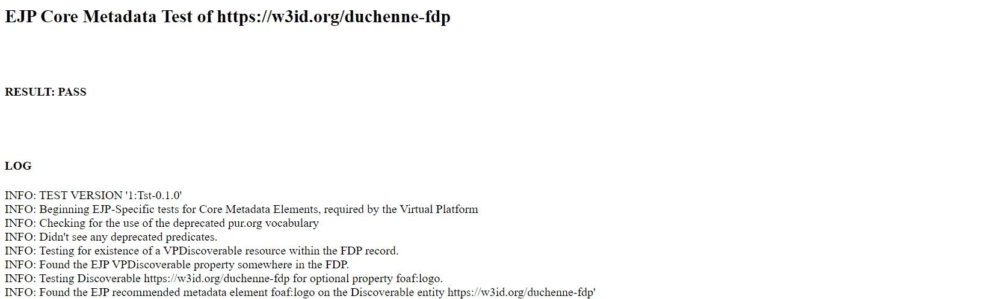

Validate your L1 metadata implementation
------------

After following these instructions, you should appear on the virtual platform. Check if your resource is listed here [`link <https://vp.ejprarediseases.org/discovery/sources>`_].  If you are still facing issues with the presentation of your resource in the platform, or if it does not appear at all, consider validating your metadata using the following method:

1. Add your FDP URL at the end of the link, following ‘?subject=’: http://testbed.ejprd.semlab-leiden.nl:40000/tests/ejp_base_metadata?subject=**YOUR_FDP_HERE**
2. Open the link to view your test results at the top (FAIL/SUCCESS). In case of FAIL, several warning messages (in orange) will appear, providing information about the missing metadata properties, as exemplified in the figure below.

    Figure - Resulting screen of the validator, in case of failure.

3. Based on the test feedback, you can either add the missing information yourself or contact the onboarding team for support. Once all the fixes are made, refresh the page to receive a success message.

..  figure:: _images/Screenshot_Success.jpeg
    :alt:  Resulting screen of the validator, in case of success.
    :width: 100%

    Figure - Resulting screen of the validator, in case of success.
